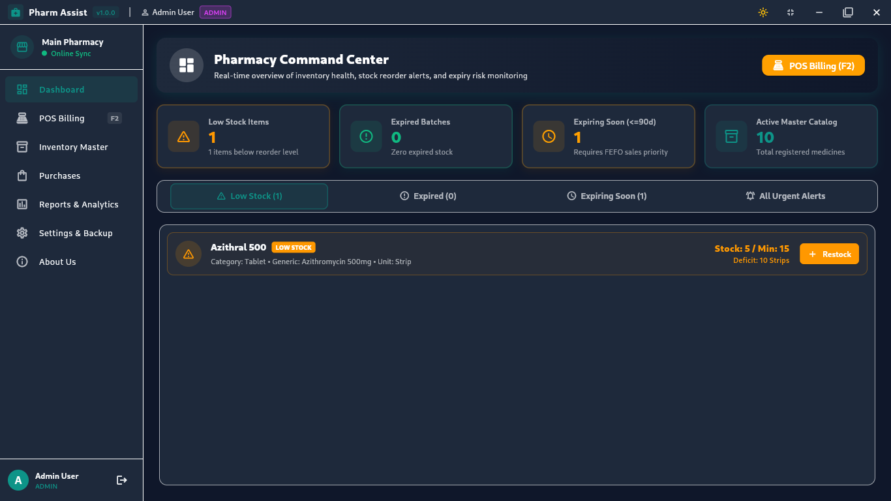
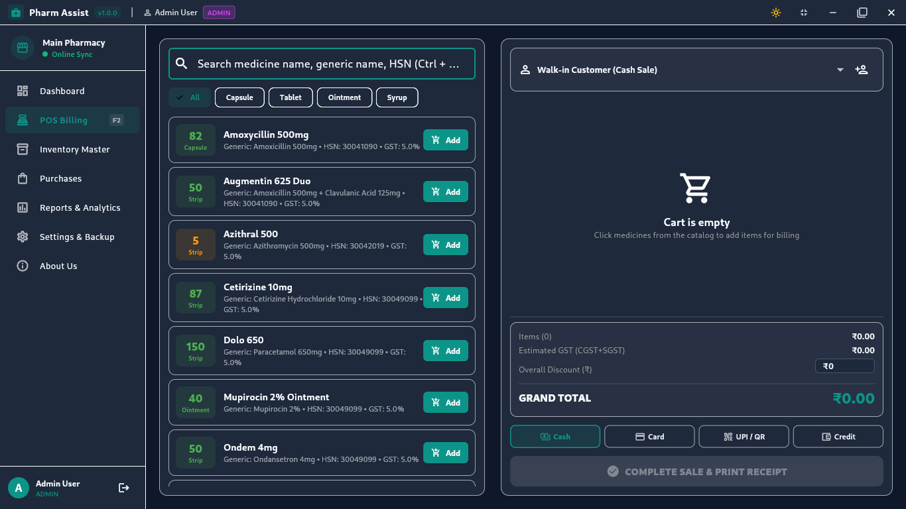
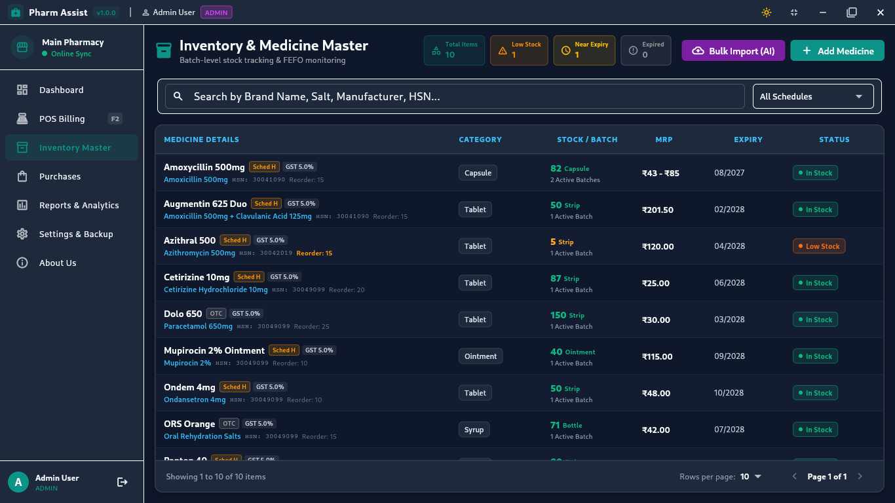
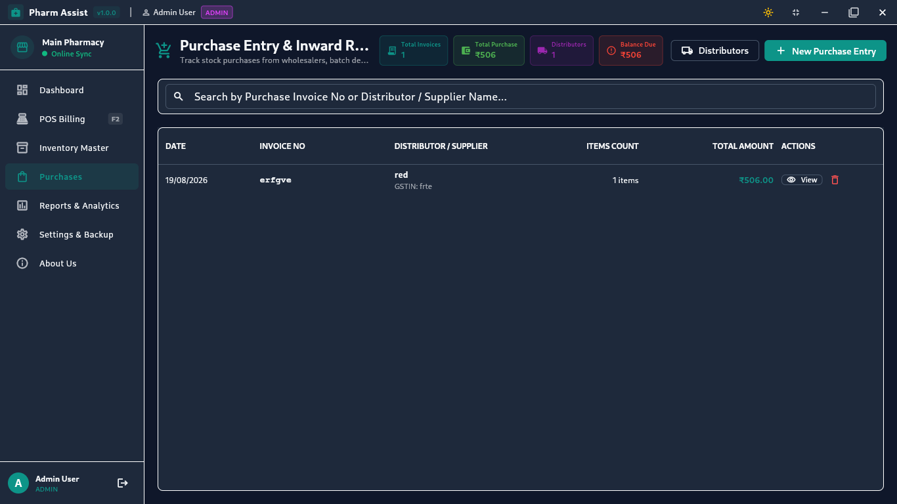
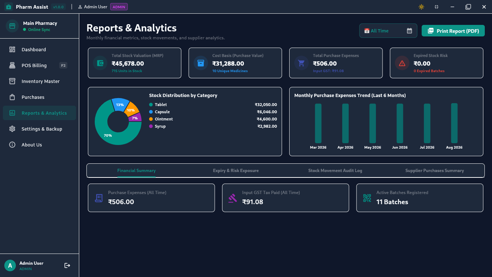
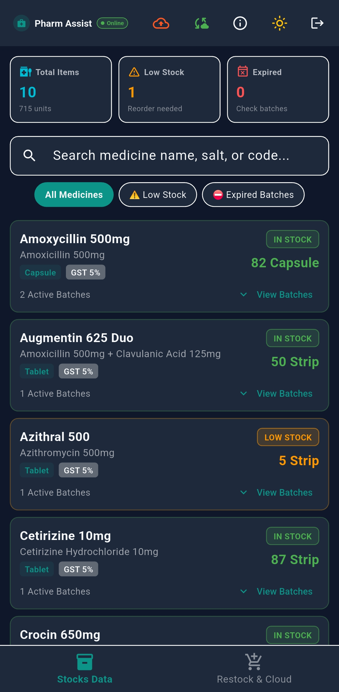
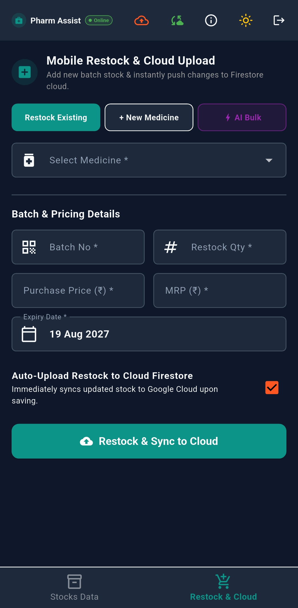

# PharmAssist ERP

PharmAssist is an open-source, enterprise-grade pharmacy management application built for desktop and mobile environments. Designed with an offline-first architecture, PharmAssist enables pharmacies to manage Point-of-Sale (POS) billing, track medicine inventory, handle bulk imports, monitor expiry dates, and synchronize data with Google Cloud Firestore.

---

## User Interface Screenshots

### Desktop ERP Dashboard

- **Key Analytics at a Glance**: Displays real-time metrics for total revenue, daily sales count, low stock warnings, and near-expiry alerts.
- **Role-Based Control**: Features dynamic navigation tailored for Administrators, Pharmacists, and Cashiers.
- **System Status**: Displays network status indicator for cloud backup synchronization.

### Point of Sale (POS) Billing System

- **Fast Product Search**: Instant lookup by medicine name, generic name, HSN code, or batch number.
- **Automated FEFO Selection**: Prioritizes batches nearing expiry (First Expiry, First Out) to minimize stock waste.
- **Real-Time Tax Calculation**: Automatic GST calculation, item discount handling, and receipt generation.
- **Keyboard Shortcut Support**: Press F11 for full-screen mode and quick key triggers during checkout.

### Inventory Master

- **Centralized Stock Registry**: Complete control over medicine master data, category tags, and unit types.
- **Batch Tracking**: Tracks individual batch numbers, manufacturing dates, expiry dates, purchase costs, and MRP.
- **Stock Audit & Adjustments**: Manual inventory adjustment logs for damagings, returns, or stock counts.
- **Automated Reorder Alerts**: Highlights items falling below defined minimum stock thresholds.

### Purchase & Invoice Management

- **Supplier & Invoicing Logs**: Maintains complete records of supplier invoices and stock inward entries.
- **Distributor Management**: Store supplier contact information, GST numbers, and payment history.
- **Bulk Batch Registration**: Add multiple medicine batches simultaneously when receiving stock shipments.

### Reports & Business Intelligence

- **Visual Performance Charts**: Revenue trends and sales distribution graphs built using FL Chart.
- **Expiry Risk Analysis**: Forecasts medicines expiring within 30, 60, or 90 days for proactive clearance.
- **Activity Audit Trail**: Logs critical user actions such as item deletions, stock updates, and price changes.

### Mobile Companion View - Dashboard


- **Responsive Touch Design**: Optimized UI layouts tailored specifically for Android smartphones and tablets.
- **On-the-Go Dashboard**: View daily earnings, bill counts, and stock alerts from anywhere in the pharmacy.
- **Navigation Drawer**: Quick access to mobile inventory, cloud sync controls, and developer settings.

### Mobile Companion View - Inventory Management


- **Mobile Stock Lookup**: Instantly search medicine availability and check shelf stock directly on mobile devices.
- **Mobile Cloud Restore**: Sync inventory updates directly with Google Cloud Firestore.
- **Touch-Optimized Lists**: High-contrast, easy-to-read list tiles for fast stock verification.

---

## Key Features

- **Offline-First Storage**: Powered by SQLite (Drift 2.x), allowing full operational capability without requiring an active internet connection.
- **Point of Sale (POS) Billing**: Fast checkout system with real-time inventory deduction, bill creation, search filtering, and receipt preview.
- **Inventory Management**: Comprehensive medicine master database supporting batch numbers, expiry dates, supplier information, stock alerts, and category tagging.
- **Bulk Data Import**: Rapid ingestion of medicine records via structured CSV or JSON files with automated validation.
- **Cloud Backup & Synchronization**: Optional two-way cloud synchronization with Google Cloud Firestore for remote accessibility across devices.
- **Role-Based Access Control**: Configurable user permission levels for Administrators, Pharmacists, and Cashiers.
- **Cross-Platform Support**: Optimized for Linux Desktop, Windows Desktop, and Android mobile devices.

---

## Technical Architecture

PharmAssist is built using modern cross-platform software standards:

- **Framework**: Flutter 3.x with Dart 3.x
- **Local Database**: SQLite managed via Drift 2.x
- **State Management**: Flutter Riverpod 2.x
- **Cloud Backend**: Google Cloud Firestore (Firebase)
- **UI Components**: Native Material Design 3 with custom dark and light themes

---

## Installation Guide for Non-Technical Users

This guide explains how to install and run PharmAssist on your computer or Android device, step by step.

### Installing on Linux

1. **Download the Application**:
   Download the latest release package (`pharmassist-linux.tar.gz` or `.deb`) from the official GitHub Releases page:
   `https://github.com/ReverseEngineeringDude/PharmAssist/releases`

2. **Extract the Files**:
   Right-click the downloaded folder and select **Extract Here**, or open a terminal in your Downloads folder and run:
   ```bash
   tar -xzf pharmassist-linux.tar.gz
   ```

3. **Run PharmAssist**:
   Double-click the `pharmassist` executable file inside the extracted folder to launch the application.

---

### Installing on Windows

1. **Download the Installer**:
   Visit the GitHub Releases page and download `PharmAssist-Setup.exe` or `pharmassist-windows.zip`.

2. **Run the Setup**:
   Double-click `PharmAssist-Setup.exe` and follow the on-screen instructions to complete the setup.

3. **Launch the Application**:
   Open PharmAssist from your Desktop shortcut or Start Menu.

---

### Installing on Android Mobile

1. **Download the APK File**:
   Open your mobile browser, navigate to the GitHub Releases page, and download `pharmassist-mobile.apk`.

2. **Allow Installation from Unknown Sources**:
   If prompted by your device, navigate to **Settings > Security**, and enable **Install Unknown Apps** for your browser.

3. **Install and Open**:
   Tap the downloaded APK file in your Downloads folder to install PharmAssist on your smartphone or tablet.

---

## Developer Setup and Source Code Compilation

If you wish to build PharmAssist from source code or modify the application:

### Prerequisites

Ensure the following tools are installed on your development machine:

1. **Flutter SDK**: Version 3.19.0 or higher.
2. **Dart SDK**: Version 3.3.0 or higher.
3. **Git**: Version control system.
4. **Build Tools**:
   - For Linux: `clang`, `cmake`, `ninja-build`, `pkg-config`, `libgtk-3-dev`.
   - For Windows: Visual Studio 2022 with Desktop development with C++.

### Installation Steps

1. **Clone the Repository**:
   ```bash
   git clone https://github.com/ReverseEngineeringDude/PharmAssist.git
   cd PharmAssist
   ```

2. **Install Dependencies**:
   ```bash
   flutter pub get
   ```

3. **Generate Local Database Code**:
   ```bash
   dart run build_runner build --delete-conflicting-outputs
   ```

4. **Run the Application**:
   ```bash
   flutter run -d linux      # For Linux Desktop
   flutter run -d windows    # For Windows Desktop
   flutter run -d android    # For Connected Android Device
   ```

5. **Build Release Binaries**:
   ```bash
   flutter build linux --release
   flutter build windows --release
   flutter build apk --release
   ```

---

## Configuring Firebase Cloud Synchronization (Optional)

PharmAssist functions completely offline out of the box. If you wish to enable cloud data backup across multiple devices:

1. Create a project in the Google Firebase Console (`https://console.firebase.google.com`).
2. Register a Cloud Firestore Database in Native Mode.
3. Obtain your Firebase Configuration Parameters (API Key, App ID, Messaging Sender ID, Project ID).
4. Launch PharmAssist, navigate to **Settings & Backup > Cloud Sync**, enter your credentials, and click **Save & Test Connection**.

---

## Contributing to PharmAssist

PharmAssist is open-source software licensed under the MIT License. Contributions from developers, designers, translators, and pharmacy domain experts are welcome.

### How You Can Contribute

- **Report Bugs**: Open an issue on GitHub describing any errors or unexpected behavior.
- **Suggest Features**: Submit feature requests via GitHub Issues or discuss them in our Telegram community.
- **Submit Code**: Fork the repository, create a topic branch, commit your changes, and open a Pull Request.
- **Improve Documentation**: Help refine user manuals, setup guides, or translations.

### Contribution Workflow

1. Fork the project repository on GitHub.
2. Create a feature branch:
   ```bash
   git checkout -b feature/your-feature-name
   ```
3. Commit your changes with clear, descriptive commit messages:
   ```bash
   git commit -m "Add barcode scanning support to POS billing"
   ```
4. Push to your branch:
   ```bash
   git push origin feature/your-feature-name
   ```
5. Open a Pull Request on the main repository.

---

## Community and Support

For questions, support, or community discussions, reach out through our official handles:

- **Developer**: Praveen MT (Red)
- **Email Contact**: praveenmtdarker@gmail.com
- **Telegram Channel**: https://t.me/pharmassistsoftware
- **GitHub Repository**: https://github.com/ReverseEngineeringDude/PharmAssist
- **Issue Tracker**: https://github.com/ReverseEngineeringDude/PharmAssist/issues

---

## License

This project is open-source software released under the [MIT License](LICENSE).
